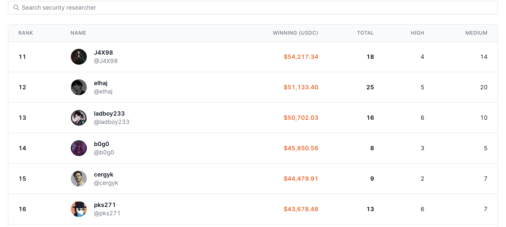

## About

I'm an independent security researcher, currently active in smart contract contests and bug bounty platform.

Now I'm mostly focus on solidity smart contract security and open for private audits or security consulting about Solidity/Rust/Go smart contract or cosmos chains. If anything I can help you please contact with me by discord: `pks7323`, twitter: [`@pks_eth`](https://x.com/pks_eth) or gmail: `looperx95@gmail.com`.

If you are a team and is searching a security researcher as team audit also welcome.

## Highlights

- [Cantina Profile](https://cantina.xyz/u/pks271)
- Ranked #16 on Cantina for July 2024

### Price

`nSLOC * 10 USDC`, measured by https://github.com/Consensys/solidity-metrics

You can also inquiry me for discount if the codebase is large.

### Audit Contest

| Platform| Contest | Date | Category | Findings | Ranking | Report |
| ------- | ------- | ----- | :-------: | :------:| :-----:| :------:| 
| Cantina | [Curvance](https://cantina.xyz/competitions/ac757733-81a4-43c7-8f49-17c5b135cdff)    | Feb 2024 | Lending | 1H 3M | 14 | [Link](./contests/curvance.md) |
| Cantina | [Wormhole](https://cantina.xyz/code/627528d0-db8a-4c42-b8b4-a5760ff31baf/findings/88) | Mar 2024 | bridge | 1M | 2 | [Link](https://github.com/wormhole-foundation/wormhole-audits/blob/main/2024-04-cantina-wormhole-evm-ntt.pdf) |
| Cantina | [Opal](https://cantina.xyz/competitions/28425672-ce54-4c66-b188-c4d5650d6790) | Feb 2024 | yield vault | 5H 1M | 4 | N/A |
| Cantina | [Superfarm](https://cantina.xyz/competitions/2cd0b038-3e32-4db6-b488-0f85b6f0e49f) | Nov 2024 | bridge & yield vault | 1M | 19 | [Link](https://github.com/superform-xyz/superform-core/blob/main/security-review/2023-12-cantina-competition.md) |
| Sherlock | [Bond option](https://audits.sherlock.xyz/contests/99) | July 2023	 | Option Trading	 | 2M | 7 | [Link](https://github.com/sherlock-audit/2023-06-bond-judging) |

### Disclaimer

A smart contract security review can never verify the complete absence of vulnerabilities. This is a time, resource and expertise bound effort where I try to find as many vulnerabilities as possible. I can not guarantee 100% security after the review or if even the review will find any problems with your smart contracts.
